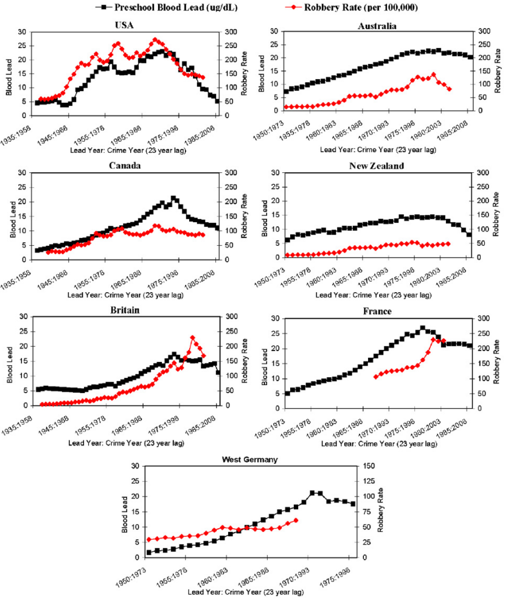

---
title: "STAT340 Lecture 07: Prediction (regression & classification)"
output: html_document
---

These notes on *prediction* are based on Karl Rohe's. Parts of these notes also adapted from
[here](https://github.com/jefftwebb/IS-6489-Course-Notes/blob/master/06-linear_regression.Rmd),
[here](https://github.com/desmond-ong/stats-notes/blob/master/06-a-regression.Rmd),


# Prediction    

In a prediction problem, you are given data pairs $(X_1, Y_1), (X_2, Y_2), \dots, (X_n, Y_n)$ and you want to use $X_i$ to predict $Y_i$.  We typically imagine $X_i$ as containing several values (i.e. it is a "vector").  

There are two types of prediction problems, continuous $Y_i$ and discrete $Y_i$.  For example, you might want to predict tomorrow's the price for asset $i$ using data that is available today. So, develop an historical training set, where you have information on asset $i$ from one day contained in $X_i$ and that asset's price for the next day contained in $Y_i$.  Here, stock price is continuous.  

Alternatively, you might only be interested in knowing if you should buy the stock, sell the stock, or hold the stock.  So, you develop an historical training set where $X_i$ contains the information that is available on one day. Then, you develop "labels" $Y_i$ using data from the next day that say whether you should have bought, sold, or held onto the asset.  Here, the label (buy, sell, hold) is discrete.  

We will often call continuous outcomes "regression" and discrete outcomes "classification".

Alternatively, perhaps we want to make predictions about the 2020 election.  You could try to predict who is going to win (classification) or the number of delegates/votes that the Republicans recieve (regression).  

In the cases above, there are two natural versions of the same problem (one is regression and one is classification).  However, many classification problems do not have an analogous regression problem.  For example, in the handwritten digit example in [Chapter 1 of ISLR](http://pages.stat.wisc.edu/~karlrohe/ht/01-introduction.pdf), $X_i$ is an image of a handwritten digit and $Y_i$ is a label that says whether the digit is 0, 1, 2, 3, 4,... , or 9.  

We are going to imagine two broad approaches to regression and classification.  

1)  **Model-based approaches** parameterize the distribution of $Y_i$ given $X_i$.  That is, we imagine $Y_i$ being a random variable that follows some distribution and that distribution is somehow parameterized by the variables in $X_i$. 
2)  **Black-box approaches** are defined algorithmically. 

[Chapter 2 in ISLR](http://pages.stat.wisc.edu/~karlrohe/ht/02-statistical_learning.pdf) provides a broad overview of prediction. In the previous weeks of this course, Monte Carlo provided the basic computational tool; we were always working to get the problem stated as something that we could solve with Monte Carlo.  Now, the basic computational tool is numerical optimization. We will not write code to do optimization.  Instead, we will see optimization problems multiple times; it is often used to define our various techniques. 

## Regression

## Example: Simple Linear Regression (SLR)

### Background

[ISLR Chapter 2](http://pages.stat.wisc.edu/~karlrohe/ht/02-statistical_learning.pdf)

[Devore regression notes](https://www.colorado.edu/amath/sites/default/files/attached-files/ch12_0.pdf)

### Demo - Lead poisoning and violent crimes

You are encouraged to follow along here with the demo! The data below comes from real sources.

In the 1920s, [Thomas Midgley Jr.](https://en.wikipedia.org/wiki/Thomas_Midgley_Jr) discovered that adding [tetraethyllead](https://en.wikipedia.org/wiki/Tetraethyllead) to gasoline decreased engine knocking (i.e. fuel doesn't ignite correctly in engine, which may damage the engine). He won the prestigious 1923 Nichols medal for his discovery. There were other safer additives, but because he and General Motors owned a patent on tetraethyllead, they marketed it as the best option.

Later, in the 1950s to 70s, people began to realize the increased levels of lead in the atmosphere due to all the leaded gasoline being burned was causing widespread lead poisoning, with symptoms ranging from depression, loss of appetite, and amnesia to  anemia, insomnia, slurred speech, and cognitive impairment like decrease in concentration and loss of short-term memory. In the 1980s its usage was slowly phased out ^[https://archive.org/details/toxictruthscient00denw_0/page/210/mode/2up].

Later, in the late 1990s to early 2000s, researchers also realized levels of lead in the atmosphere correlated strongly with rates of violent crime later in life ^[https://ir.lawnet.fordham.edu/ulj/vol20/iss3/1] ^[https://doi.org/10.1016/j.envres.2007.02.008]. This study was first conducted in the US, but it was soon replicated in other countries and the same results were found over and over again.





Let's look at a [dataset](https://doi.org/10.1016/j.envint.2012.03.005) that contains atmospheric lead content levels and aggravated assault rates for several cities in the US and see if we can build a simple linear regression model to effectively explain the trend and make predictions. The data we are using comes from.

For simplicity, let's focus on the city of Atlanta. First, we plot the data. The variables here are metric tons of lead in atmosphere (independent/explanatory), and aggravated assault rate per million 22 years later (dependent/response).

```{r,message=F,warning=F}
library(tidyverse)

lead = read_csv("https://raw.githubusercontent.com/kdlevin-uwstat/STAT340-Fall2021/93c315a378f3fe421e7e2217f9b039471d313741/lecs/06/lead.csv")

head(lead)

atlanta_lead = lead %>% filter(city == "Atlanta")

ggplot(atlanta_lead,aes(x=air.pb.metric.tons, y=aggr.assault.per.million)) + 
  geom_point() + labs(x="Lead in air (metric tons)",
                      y="Aggravated assault rate (per million)",
                      title="Violent crime v. atmospheric lead (22 year lag)")
```

The data is a little wider at one side than the other side, but the trend does appear to be pretty linear. We can use the `geom_smooth()` function to get `ggplot` to plot the line of best fit for us before we fit it manually ourselves.

```{r}
ggplot(atlanta_lead,aes(x=air.pb.metric.tons,y=aggr.assault.per.million)) + 
  geom_point() + geom_smooth(method="lm", formula="y~x", se=F) + 
  labs(x="Lead in air (metric tons)",
       y="Aggravated assault rate (per million)",
       title="Violent crime v. atmospheric lead (22 year lag)")
```

To build a linear model, the syntax is as simple as `lm(y~x, data=df)`. Running `summary()` on the model object gives us a variety of useful summary statistics and other information about the model.

```{r}
atlanta_lead_lm = lm(aggr.assault.per.million ~ air.pb.metric.tons, data=atlanta_lead)
summary(atlanta_lead_lm)
```

You can also access key properties of the model using certain built in functions

```{r}
# gets fitted y-values (points on line of best fit)
fitted(atlanta_lead_lm)

# gets residuals (difference between actual y and fitted y)
resids = residuals(atlanta_lead_lm)    # can also use resid()
resids

# gets coefficients of model
coefs = coefficients(atlanta_lead_lm)  # can also use coef()
coefs
```

We can plot our model just to make sure it looks correct and appropriate.

```{r}
ggplot(atlanta_lead,aes(x=air.pb.metric.tons,y=aggr.assault.per.million)) + 
  geom_point() + 
  geom_abline(slope=coefs[2], intercept=coefs[1], color="red") + 
  labs(x="Lead in air (metric tons)",
       y="Aggravated assault rate (per million)",
       title="Violent crime v. atmospheric lead (22 year lag)")
```

A good way of seeing if our model looks appropriate is by examining the residuals. Remember, we want to check if the residuals look normal, have mean 0, and have constant variance. Most of these looks pretty good; there's some change in the variance across the dataset, but it's not too large.

```{r}
par(mfrow=c(1,3))
plot(atlanta_lead_lm,which=1:2,ask=F)
hist(resids)
```

Note the summary tells us that our slope estimate is significant. This basically conducts a $t$-test to see if it's significantly different from 0. In this case it is. Note that this is strictly speaking **correlation, NOT causation**. However, it's a **very suspicious correlation** and warrants further studies and analysis. We can also get confidence intervals for our coefficients.    

```{r}
confint(atlanta_lead_lm, level=0.95)
```

At the very least, lead in air is **a useful predictor** for levels of violent crime 22 years later. For example, suppose tomorrow, a chemical company near Atlanta has an explosion, and some more lead is released into the atmosphere. New measurements of lead are found to be 1300 metric tons. What would you predict the approximate aggravated assault rate in 2043 to be?

```{r}
predict(atlanta_lead_lm, newdata=data.frame(air.pb.metric.tons=1300))
```

Suppose the lead factory continues to release more lead into the atmosphere, and next year, the levels are measured to be 2000 metric tons. Can we use our model to predict what aggravated assault rates in 2044 might look like?

```{r}
predict(atlanta_lead_lm, newdata=data.frame(air.pb.metric.tons=2000))
```

These predictions have to be treated more carefully, since they are out of the range of our data. They may be reliable, but they also may not. The reliability of a prediction usually decreases the further away it is from your data.

<center><a href="https://xkcd.com/1007/"></a></center>


# Part 1: Simple regression (1 predictor)

## Brief review

### Model equation

A simple linear model has an outcome, $y$, and one predictor, $x$. It is defined by the following equation.

$$
y_i = \beta_0 + \beta_1x_i + \epsilon_i,
$$

where $i = 1, \ldots, n$. This equation represents the true, theoretical, equation, with slope $\beta_1$ and intercept $\beta_0$

The subscript in this equation, $i$, indexes the $n$ observations in the dataset. (Think of $i$ as a row number.) The equation can be read as follows:  the value of $i^{th}$ outcome variable, $y_i$, is defined by an intercept, $\beta_0$, plus a slope, $\beta_1$, multiplied by the $i^{th}$ predictor variable, $x_i$. These elements define the *systematic* or *deterministic* portion of the model. However, because the world is uncertain, containing randomness, we know that the model will be wrong (as George Box said). To fully describe the data we need an error term, $\epsilon_i$, which is also indexed by row. The error term is the *stochastic* portion of the model. $\epsilon_i$ measures the distance between the fitted or expected values of the model---calculated from the deterministic portion of the model---and the actual values.

The errors in a linear model---also known as model residuals---are the part of the data that remains unexplained by the deterministic portion of the model. One of the key assumptions of a linear model is that the residuals are normally distributed with mean = 0 and variance = $\sigma^2$, which we denote as

$$
\epsilon_i\sim N(0,\sigma^2)
$$

### Loss function

For **ordinary least squares** regression, we have the following **loss function** (or error function).

$$
\operatorname{RSS} = \sum_{i=1}^n ((\beta_0 + \beta_1x_i) - y_i)^2 = \sum_{i=1}^n (\hat{y}_i - y_i)^2
$$

where $\hat{y_i}=\beta_0+\beta_1x$ is the predicted $y_i$ based on the coefficients $\beta_0,\beta_1$. This function represents something we want to minimize. The higher the loss, the worse the estimate; the lower the loss, the better the estimate.

Note: since the residuals can be positive or negative, so if we simply add the residuals up we might be canceling out some of them. So instead of minimizing the sum of the residuals, we usually choose to **square the residuals and minimize the sum of squares of the residuals**. (Mathematically it becomes easier to work with the square than the absolute value). 

This is not the only possible loss function, there are other ones! However, for simple linear regression, this is the simplest possible loss function to work with, and it's also the most commonly used (kind of by default) so we're using it too here.

When we fit a line of regression through the data, we are trying to find estimates $\hat{\beta_0}$ and $\hat{\beta_1}$ such that we minimize the loss function. I.e., our goal is to find

$$
\hat{\beta_0},\hat{\beta_1} = \arg\min_{\beta_0,\beta_1} \sum_{i=1}^n ((\beta_0 + \beta_1x_i) - y_i)^2
$$

The math for this is actually surprisingly not that difficult, so we show the derivation below.

### Derivation of estimates

We can do this by taking the partial derivative with respect to $\hat{\beta_0}$ and $\hat{\beta_1}$, and setting them both to 0. First, we define the following variables to simplify notation:


\begin{align}
\text{Define } \bar{y} &:= \frac{1}{n}\sum_i^n y_i \\
\text{Define } \bar{x} &;= \frac{1}{n}\sum_i^n x_i \\
\text{Define } Z &:= \sum_i\left( y_i - \beta_0 - \beta_1 x_i \right)^2 \\
\end{align}

Then we take the partial derivative with respect to $\beta_0$, solve for this $\beta_0$, then substitute it into the partial derivative with respect to $\beta_1$:
\begin{align}
\text{Partial deriative w.r.t. } \beta_0 : \; \; 
\frac{\partial Z}{\partial \beta_0} &= \sum_i^n -2 \left(y_i - \beta_0 - \beta_1x_i \right) \\
\text{Setting the derivative to 0 and solving: } \; \; ~~~~
\hat{\beta_0} &= \frac{1}{n}\sum_i^n y_i - \frac{1}{n}\sum_i^n\hat{\beta_1}x_i \\
\implies ~~~~~ \hat{\beta_0} &= \bar{y} - \hat{\beta_1} \bar{x} \\
\text{Partial deriative w.r.t. } \beta_1 : \; \;\frac{\partial Z}{\partial \beta_1} &= \sum_i^n  -2x_i \left( y_i - \beta_0 - \beta_1x_i \right) 
\end{align}
\begin{align}
\text{Setting the derivative to 0 and substituting $\hat{\beta_1}$, we have: } & \\
\sum_i^n x_i y_i - \sum_i^n (\bar{y}-\hat{\beta_1}\bar{x})x_i - \sum_i^n\hat{\beta_1}x_i^2 &= 0 \\
\sum_i^n x_i y_i - \bar{y} \sum_i^n x_i + \hat{\beta_1} \left(\bar{x} \sum_i^n x_i - \sum_i^n x_i^2 \right) &= 0 \\
\hat{\beta_1} &= \frac{\sum_i^n x_i y_i - \bar{y}\sum_i^n x_i }{ \sum_i^n x_i^2 - \bar{x} \sum_i^n x_i } \\ &= \frac{\sum_i^n x_i y_i - n\bar{x}\bar{y}}{ \sum_i^n x_i^2 - n\bar{x}^2} \\
\text{simplifying: } \; \; \hat{\beta_1} &= \frac{\sum_i^n (x_i - \bar{x})(y_i - \bar{y})}{ \sum_i^n (x_i - \bar{x})^2 }
\end{align}

And we end up with the final OLS solution:

\begin{align}
\hat{\beta_0} &= \bar{y} - \hat{\beta_1} \bar{x} \\
\hat{\beta_1} &= \frac{\sum_i^n (x_i - \bar{x})(y_i - \bar{y})}{ \sum_i^n (x_i - \bar{x})^2 } = \frac{Cov(x,y)}{Var(x)}
\end{align}

Then, we can use these to find our predicted $\hat{y_i}$, i.e. the $y$ values on the line.

$$
\hat{y_i}=\hat{\beta_0}+\hat{\beta_1}x_i
$$

as well as our model residuals $\hat{\epsilon}_i$

$$
\hat{\epsilon_i}=y_i-\hat{y_i}
$$

From this, we also get for free an estimate of the variance of the residuals $\sigma^2$, which happens to be very useful in computing other statistics. The reason is that **the larger the residuals' variance, the less precisely we can estimate our regression coefficients**, which should make a lot of sense.

$$
\hat{\sigma}^2=\text{mean squared error}=\frac{SSE}{n-2}=\frac1{n-2}\sum_i(y_i-\hat{y_i})^2
$$

We can also easily derive the variance of the slope. First, observe that

\begin{align}
\sum_i (x_i - \bar{x})\bar{y}
&= \bar{y}\sum_i (x_i - \bar{x})\\
&= \bar{y}\left(\left(\sum_i x_i\right) - n\bar{x}\right)\\
&= \bar{y}\left(n\bar{x} - n\bar{x}\right)\\
&= 0
\end{align}

This means that

\begin{align}
\sum_i (x_i - \bar{x})(y_i - \bar{y})
&= \sum_i (x_i - \bar{x})y_i - \sum_i (x_i - \bar{x})\bar{y}\\
&= \sum_i (x_i - \bar{x})y_i\\
&= \sum_i (x_i - \bar{x})(\beta_0 + \beta_1x_i + \epsilon_i )\\
\end{align}

Using this, we can easily derive $\text{Var}(\hat{\beta_1})$ as follows:

\begin{align}
\text{Var}(\hat{\beta_1})
& = \text{Var} \left(\frac{\sum_i (x_i - \bar{x})(y_i - \bar{y})}{\sum_i (x_i - \bar{x})^2} \right) \\
&= \text{Var} \left(\frac{\sum_i (x_i - \bar{x})(\beta_0 + \beta_1x_i + \epsilon_i )}{\sum_i (x_i - \bar{x})^2} \right), \;\;\;\text{substituting in the above} \\
&= \text{Var} \left(\frac{\sum_i (x_i - \bar{x})\epsilon_i}{\sum_i (x_i - \bar{x})^2} \right), \;\;\;\text{noting only $\epsilon_i$ is a random variable} \\
&=  \frac{\sum_i (x_i - \bar{x})^2\text{Var}(\epsilon_i)}{\left(\sum_i (x_i - \bar{x})^2\right)^2} , \;\;\;\text{independence of } \epsilon_i \text{ and, Var}(cX)=c^2\text{Var}(X) \\
&= \frac{\sigma^2}{\sum_i (x_i - \bar{x})^2} \\
\end{align}


### Model diagnostics

At this point it's important to run some diagnostics on our model to check if our assumptions are well satisfied.

Assumptions like **independence** and data actually having a **theoretical linear relationship** are usually not things you can really check in the data, so we tend to hope they are true. You can usually determine based on the way the data was gathered and by looking at a plot of the data to determine if there are major violations of these two assumptions, but generally speaking, these may be harder to assess.

That usually leaves us with 3 main things to check:
 - residuals have mean 0
 - residuals have constant variance
 - residuals are normally distributed


#### 1. Residual vs. Fitted plot


##### The ideal case


Let's begin by looking at the Residual-Fitted plot coming from a linear model that is fit to data that perfectly satisfies all the of the standard assumptions of linear regression.  What are those assumptions?  In the ideal case, we expect the $i$th data point to be generated as:

$$y_i = \beta_0 + \beta_1x_{1i} + \cdots + \beta_p x_{pi} + \epsilon_i$$

where $\epsilon_i$ is an "error" term with mean 0 and some variance $\sigma^2$.  


To create an example of this type of model, let's generate data according to 

$$y_i = 3 + 0.1 x + \epsilon_i,$$ 

for   $i = 1, 2, \ldots, 1000$, where the $\epsilon_i$ are independent Normal$(0,sd = 3)$ variables (with standard deviation 3).  

Here's code to generate this data and then regress y on x.

```{r}
library(ggplot2)

n <- 1000      # sample size
x <- runif(n, min = 0, max = 100)
y.good <- 3 + 0.1 * x + rnorm(n, sd = 3)

# Scatterplot of the data with regression line overlaid
qplot(x, y.good, ylab = "y", main = "Ideal regression setup") + stat_smooth(method = "lm")

# Run regression and display residual-fitted plot
lm.good <- lm(y.good ~ x)
plot(lm.good, which = 1)  
```

The scatterplot shows the perfect setup for a linear regression:  The data appear to be well modeled by a linear relationship between $y$ and $x$, and the points appear to be randomly spread out about the line, with no discernible non-linear trends or indications of non-constant variance.  

When we look at the diagnostic plots, we'll see perfect behavior.  The quantities that enter into the diagnostic plot are:

- Fitted values: $\hat y_i = \hat \beta_0 + \hat \beta_1x_{1i} + \cdot \hat\beta_p x_{pi}$
  - Here, $\hat \beta_j$ is the *estimated* value of the coefficient for variable $j$
- Residuals: $r_i = y_i - \hat y_i$

You can think of the residuals $r_i$ as being estimates of the error terms $\epsilon_i$.  So anytime we're looking at a plot that involves residuals, we're doing so because we're trying to assess whether some assumption about the errors $\epsilon_i$ appears to hold in our data.  

Looking at the Residuals vs Fitted plot (showing $r_i$ on the y-axis and $\hat y_i$ on the x-axis), we see that the red line (which is just a scatterplot smoother, showing the average value of the residuals at each value of fitted value) is perfectly flat.  This tells us that there is no discernible non-linear trend to the residuals.  Furthermore, the residuals appear to be equally variable across the entire range of fitted values.  There is no indication of non-constant variance.

```{r}
# Display scale-location plot
plot(lm.good, which = 3)  
```

The scale-location plot is a more sensitive approach to looking for deviations from the constant variance assumption.  If you see significant trends in the red line on this plot, it tells you that the residuals (and hence errors) have non-constant variance.  That is, the assumption that all the $\epsilon_i$ have the same variance $\sigma^2$ is not true.  When you see a flat line like what's shown above, it means your errors have constant variance, like we want to see.  

##### Curvature or non-linear trends

Here's an example where we have non-linear trends in the data.  This example is constructed to mimic seasonal data.  

```{r, echo=FALSE}
y.curved <- 5 * sin(0.6 * x) + 0.1 * x + rnorm(n, sd = 2)

# Scatterplot of the data
qplot(x, y.curved, ylab = "y", main = "Data with a seasonal trend") + 
  stat_smooth(method = "lm") + stat_smooth(method = "loess", span = 0.1, colour = I("red"))
```

The blue line shows the model fit.  The red curve is a non-linear fit that does a better job of modelling the average value of $y$ at each value of $x$.   Note that the linear model fails to capture the clear non-linear trend that's present in the data.  This causes tremendous problems for our inference.  Look at the grey confidence band that surrounds the regression line.  If the standard linear regression assumptions are satisfied, this band with high likelihood would contain the average value of $y$ at each value of $x$.  i.e., the grey bands around the blue curve should mostly contain the red curve.  This obviously does not happen.  The red curve is almost always far outside the grey bands around the blue regression line.  

**Take-away**:  When one or more of the model assumptions underlying the linear model is violated, we can no longer believe our inferential procedures.  E.g., our confidence intervals and p-values may no longer be reliable.

Here's what the Residual - Fitted plot looks like for this model.

```{r}
lm.curved <- lm(y.curved ~ x)

plot(lm.curved, which = 1)
```

Visually, we see a clear trend in the residuals.  They have a periodic trend.  Unfortunately, the scatterplot smoother that's used to construct the red line isn't doing a good job here.  This is a case where the choice of neighbourhood size (how many points go into calculating the local average) is taken to be too large to capture the the trend that we visually observe.  Don't always trust that red curve.  

##### Constructing your own Residual vs Fitted plot

Here's a better version of the default plot.  

```{r}
# Plot model residuals on y axis, fitted values on x axis
# Add red trend curve with better choice of smoothing bandwidth
qplot(y = lm.curved$residuals, x = lm.curved$fitted.values,
      ylab = "Residuals", xlab = "Fitted values", 
      main = "The Do-it-yourself Residuals vs. Fitted plot") +
  stat_smooth(method = "loess", span = 0.1, colour = I("red"), se = FALSE)
```

#### Non-constant variance

In this example we'll generate data where the error variance increases with $x$.  Our model will be:

$$
y_i = 3 + 0.2x_i + \epsilon_i
$$
where $$\epsilon_i \sim N(0, 9(1 + x/25)^2)$$.  

```{r}
y.increasing <- 3 + 0.2 * x + (1 + x / 25) * rnorm(n, sd = 3)

# Produce scatterplot of y vs x
qplot(x, y.increasing, ylab = "y")
```

Here's what the Residual vs. Fitted plot looks like in this case.

```{r}
lm.increasing <- lm(y.increasing ~ x)
plot(lm.increasing, which = 1)
```

If you look at this plot, you'll see that there's a clear "funneling" phenomenon.  The distribution of the residuals is quite well concentrated around 0 for small fitted values, but they get more and more spread out as the fitted values increase. This is an instance of "increasing variance".  Here's what the scale-location plot looks like in this example:

```{r}
plot(lm.increasing, which = 3)
```

Note the clear upward slope in the red trend line.  This tells us we have non-constant variance.  


The standard linear regression assumption is that the variance is constant across the entire range.  When this assumption isn't valid, such as in this example, we shouldn't believe our confidence intervals, prediction bands, or the p-values in our regression.  


#### Normal QQ plot

The Normal QQ plot helps us to assess whether the residuals are roughly normally distributed.  If the residuals look far from normal we may be in trouble.  In particular, if the residual tend to be larger in magnitude than what we would expect from the normal distribution, then our p-values and confidence intervals may be too optimisitic.  i.e., we may fail to adequately account for the full variability of the data.


##### The ideal case

First, here's an example of a Normal QQ plot that's as perfect as it gets.  This comes from the ideal simulation setting in the previous section.  The residuals here are a perfect match to the diagonal line.  These residuals look to be normally distributed.

```{r}
plot(lm.good, which = 2)
```

##### Lighter tails

In the next example, we see a QQ plot where the residuals deviate from the diagonal line in both the upper and lower tail.  This plot indicated that the tails are 'lighter' (have smaller values) than what we would expect under the standard modeling assumptions.  This is indicated by the points forming a "flatter" line than than the diagonal.

```{r}
plot(lm.curved, which = 2)
```

##### Heavier tails

In this final example, we see a QQ plot where the residuals deviate from the diagonal line in both the upper and lower tail.  Unlike the previous plot, in this case we see that the tails are observed to be 'heavier' (have larger values) than what we would expect under the standard modeling assumptions.  This is indicated by the points forming a "steeper" line than the diagonal.

```{r}
plot(lm.increasing, which = 2)
```

#### Bonus: Outliers and the Residuals vs Leverage plot

There's no single accepted definition for what consitutes an outlier.  One possible definition is that an outlier is any point that isn't approximated  well by the model (has a large residual) and which significantly influences model fit (has large leverage).  This is where the Residuals vs Leverage plot comes in.  

##### The ideal case

Let's look at our ideal setting once again.  The plot below is a great example of a Residuals vs Leverage plot in which we see no evidence of outliers. Those "Cook's distance" dashed curves don't even appear on the plot.  None of the points come close to having both high residual and leverage.

```{r}
plot(lm.good, which = 5)
```

##### An example with possible outliers

```{r}
set.seed(12345)
y.corrupted <- y.good[1:100]
x.corrupted <- x[1:100]

# Randomly select 10 points to corrupt
to.corrupt <- sample(1:length(x.corrupted), 10)
y.corrupted[to.corrupt] <- - 1.5 * y.corrupted[to.corrupt] + 3 * rt(10, df = 3)
x.corrupted[to.corrupt] <- x.corrupted[to.corrupt] * 2.5
# Fit regression and display diagnostic plot
lm.corrupted <- lm(y.corrupted ~ x.corrupted)

plot(lm.corrupted, which = 5)
```

In this plot we see that there are several points that have high residual and high leverage.  The points that lie close to or outside of the dashed red curves are worth investigating further.  

##### Can't we just use scatterplots?

All of the examples above were generated by considering the regression of a single outcome variable on a single covariate.  In this case, we could've diagnosed most of the violations of model assumptions just by looking at the x-y scatterplot.  The reason for using diagnostic plots is that most regressions we run aren't so simple.  Most regressions use many variables (tens or hundreds of variables), and in those cases there isn't a good way of visualizing all of the data.  Residuals, fitted values and leverage are all quantities that can be computed and plotted regardless of how many variables are included in the model.  Thus diagnostics such as the Residual vs. Fitted plot, Normal QQ plot and Residual vs. Leverage plot can help us even when we have complicated models.


### R^2, confidence, hypothesis

TO BE CONTINUED...


<!--

## Classification example (come back to this)

Example: logistic regression. Very similar to simple linear regression, but applied to predicting categories.    
[ISLR chapter 4](http://pages.stat.wisc.edu/~karlrohe/ht/04-classification.pdf)

-->


